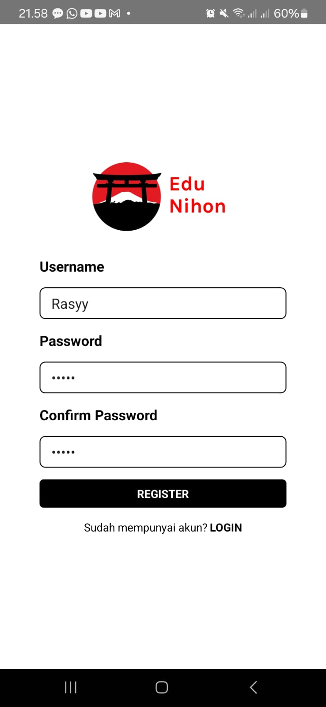
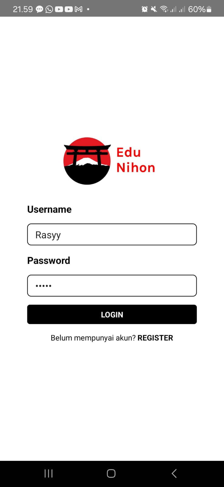
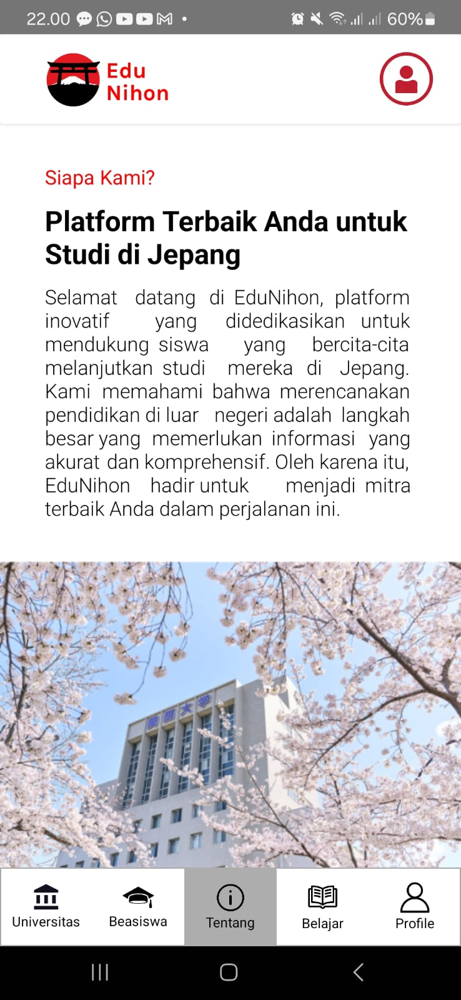
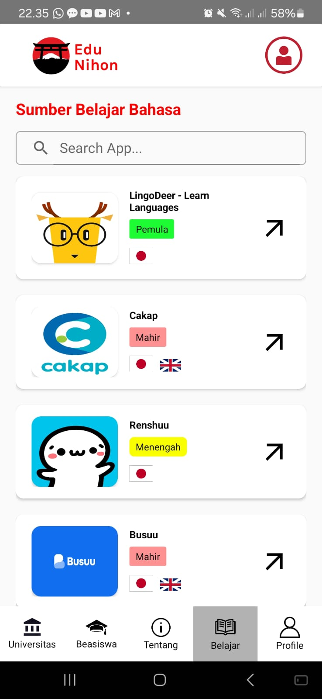
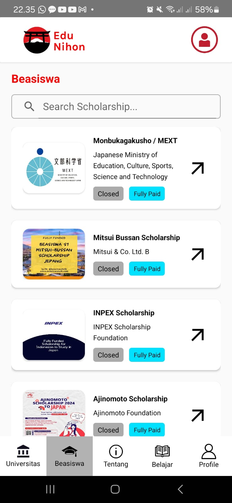
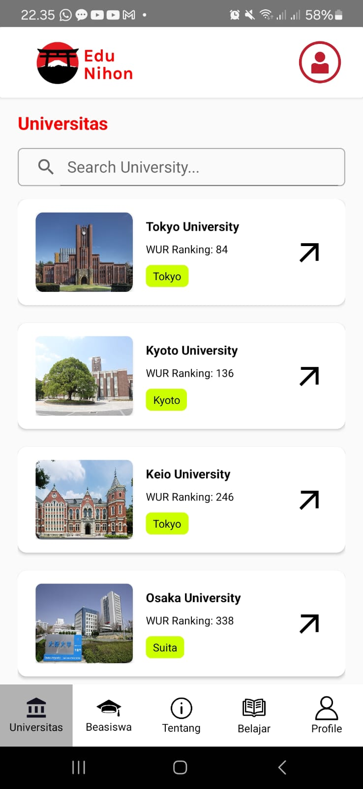
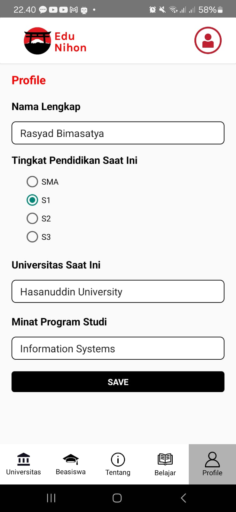

# EduNihon

  

EduNihon adalah platform yang dirancang untuk siswa yang ingin melanjutkan studi mereka di Jepang 🗾. Aplikasi ini memberikan bantuan dengan menyediakan informasi mengenai universitas-universitas di Jepang, termasuk Rating/WUR ranking, lokasi, dll. Selain itu, EduNihon menyediakan informasi tentang berbagai beasiswa untuk kuliah di Jepang dan menawarkan akses ke sumber/referensi belajar bahasa Jepang dan bahasa Inggris dari berbagai situs pembelajaran. Dengan EduNihon, siswa dapat mempersiapkan diri secara optimal untuk melanjutkan pendidikan mereka di negeri matahari terbit.

## Misi Kami

  

Misi kami adalah untuk memberdayakan siswa dengan menyediakan informasi yang akurat dan relevan, sehingga mereka dapat mempersiapkan diri dengan baik untuk melanjutkan pendidikan di Jepang. Kami percaya bahwa dengan memberikan akses kepada informasi yang komprehensif dan dukungan yang tepat, siswa akan dapat membuat keputusan yang terinformasi dan sukses dalam mencapai tujuan pendidikan mereka di Jepang.

## Mengapa Memilih EduNihon?

  

- **Komprehensif dan Terpercaya**
  - Kami menyajikan informasi yang lengkap dan dapat diandalkan, memastikan bahwa Anda memiliki semua yang Anda butuhkan untuk membuat keputusan yang tepat.

- **Dukungan Berkelanjutan**
  - EduNihon hadir untuk mendukung Anda setiap langkah, mulai dari memilih universitas hingga menemukan beasiswa dan mempersiapkan diri secara akademis dan bahasa.

- **Akses Mudah**
  - Platform kami dirancang agar mudah digunakan, sehingga Anda dapat mengakses semua informasi yang Anda butuhkan dengan cepat dan efisien.

## Fitur Utama

- **Informasi Universitas:**
  - Menyediakan data tentang universitas di Jepang, yang mencakup nama universitas, peringkat dunia (WUR ranking), lokasi, dll.

- **Informasi Beasiswa:**
  - Menyediakan detail berbagai beasiswa untuk kuliah di Jepang baik yang beasiswa penuh maupun beasiswa parsial.

- **Sumber Belajar Bahasa:**
  - Menawarkan akses ke referensi dan sumber pembelajaran bahasa Jepang dan bahasa Inggris dari berbagai situs / aplikasi pembelajaran yang dikategorikan berdasarkan level kemampuan pengguna.

- **Profil Pengguna:**
  - Menyimpan informasi profil pengguna yang mencakup:
    - Nama lengkap
    - Tingkat pendidikan saat ini
    - Universitas saat ini
    - Minat program studi
   
## Cara Menjalankan dan Membuka Aplikasi
1. Mengunduh APK.
    - Klik tautan berikut untuk mengunduh APK:  [Unduh EduNihon APK](apk/EduNihon.apk)
3. Buka aplikasi EduNihon.
4. Jika belum mempunyai akun, silahkan Register akun terlebih dahulu dengan menekan REGISTER pada halaman login.
    

      
    

5. Buat akun dengan mengisi atribut username dan password (pastikan password dan confirm password cocok), kemudian tekan tombol REGISTER.
    

      
    

6. Silahkan login dengan mengisi username dan password yang sudah terdaftar dan menekan tombol LOGIN.
    

      
    

7. Selamat! Anda sudah berhasil masuk pada aplikasi yang menampilkan halaman Tentang.
    

      
    
   

## Spesifikasi Teknis
### 1. Activity
  Aplikasi ini memiliki beberapa activity di antaranya seperti LoginActivity, RegisterActivity, MainActivity dan SplashActivity.
### 2. Intent
  Terdapat implementasi penggunaan Intent untuk berkomunikasi dan berpindah antar activity.
### 3. Recycler View
  Terdapat RecyclerView untuk menampilkan daftar data yang diantaranya berupa daftar universitas, beasiswa dan sumber belajar.
  

    
    
    
  
 

### 4. Fragment dan Navigation
  Terdapat beberapa fragment pada aplikasi ini diantaranya berupa UnivFragment, ScholarsFragment, AboutFragement, LearnFragment, ProfileFragment, dll.
  

    
    
    
    
    
  

### 5. Background Thread
  Aplikasi ini dapat menjalankan operasi di latar belakang dengan memanfaatkan Handler untuk menjalankan SplashActivity setelah interval waktu tertentu, serta melakukan request dengan metode GET pada API.

### 6. Networking
  Terdapat implementasi fungsi untuk mengambil data yang berupa web_pages dari daftar universitas pada API eksternal menggunakan Retrofit, lalu menampilkan data tersebut ke dalam aplikasi.
  
  Base Url API: http://universities.hipolabs.com

### 7. Local Data Persistent
  - Menggunakan SharedPreference untuk menyimpan data user secara lokal.
  - Data universitas, beasiswa dan sumber belajar disimpan pada array yang terletak pada file DataSource.java
